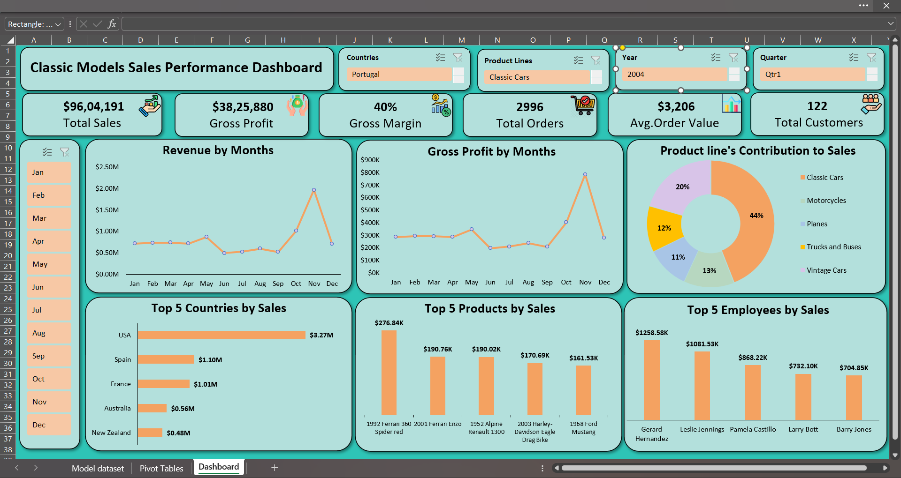

# 🚗 Classic Models — Sales Performance Dashboard

> **Turning raw transactional data into boardroom-ready insights — entirely in Microsoft Excel.**

---

## 📸 Dashboard Preview



---

## 🧭 What Is This?

A fully interactive **Business Intelligence Dashboard** built on the **ClassicModels** dataset — a relational database of a global die-cast model vehicle retailer. The dashboard answers the questions every sales leader needs answered:

- 💰 How much are we selling, and how profitable are we?
- 📈 Where are revenue trends heading month over month?
- 🌍 Which countries, products, and sales reps are driving results?
- 🧩 How does each product line contribute to total sales?

---

## ⚡ Key Metrics at a Glance

| Metric | Value |
|---|---|
| 💵 Total Sales | $9,604,191 |
| 📊 Gross Profit | $3,825,880 |
| 📉 Gross Margin | 40% |
| 🛒 Total Orders | 2,996 |
| 🧾 Avg. Order Value | $3,206 |
| 👥 Total Customers | 122 |

> *Values reflect a filtered view — all KPIs update dynamically via slicers.*

---

## 🛠️ Tech Stack

```
Microsoft Excel
├── Power Query      → Data ingestion & cleaning (8 tables)
├── Power Pivot      → Relational data modelling (star schema)
├── DAX              → Calculated measures (Sales, Profit, Margin, AOV)
├── Pivot Tables     → Multi-dimensional analysis
└── Pivot Charts     → Interactive visualisations + 4 slicers
```

---

## 📊 Charts Inside the Dashboard

| Chart | Purpose |
|---|---|
| 📅 Revenue by Months | Tracks monthly sales — reveals the Q4 November spike |
| 💹 Gross Profit by Months | Confirms margin stability across the year |
| 🍩 Product Line Contribution | Classic Cars 44% · Vintage 20% · Motorcycles 13% |
| 🌍 Top 5 Countries by Sales | USA $3.27M leads; Spain & France follow |
| 🏎️ Top 5 Products by Sales | Ferrari 360 Spider $276K tops the chart |
| 🏆 Top 5 Employees by Sales | G. Hernandez $1.26M · L. Jennings $1.08M |

---

## 💡 Top Business Insights

1. **November is the revenue engine** — Q4 spike driven by gifting season; Jan–Sep relatively flat.
2. **Classic Cars = 44% concentration** — strategic strength, but also a portfolio risk.
3. **USA outpaces all markets** — $3.27M vs Spain + France combined at $2.1M.
4. **Ferrari SKUs dominate** — iconic brands consistently win in this category.
5. **Top 3 reps drive majority of sales** — a 44% gap to 5th place signals a coaching opportunity.

---

## 📁 Repository Structure

```
📦 classic-models-dashboard
 ┣ 📊 Model_Vehicle_Final.xlsx       ← Main Excel workbook (Dashboard + Pivot Tables + Data)
 ┣ 📄 classicmodels_data_dictionary.pdf  ← Dataset reference guide
 ┣ 🖼️ Dashboard.png                  ← Dashboard screenshot
 ┣ 📋 Classic_Models_Executive_Summary.pdf  ← Full executive summary
 ┗ 📝 README.md
```

---

## 🚀 How to Use

1. **Clone or download** this repository
2. Open `Model_Vehicle_Final.xlsx` in **Microsoft Excel** (2016 or later recommended)
3. Navigate to the **Dashboard** sheet
4. Use the **4 slicers** — Country · Product Line · Year · Quarter — to filter the view
5. All KPIs and charts update **automatically** ✨

---

## 👤 About

Built by **Yatharth** as part of a hands-on **Business Analytics Portfolio**.

📍 Gwalior, India &nbsp;|&nbsp;

[](https://www.linkedin.com/in/yatharth-aphale-338b203b8)


*⭐ If you found this useful, drop a star — it helps others discover the project!*
